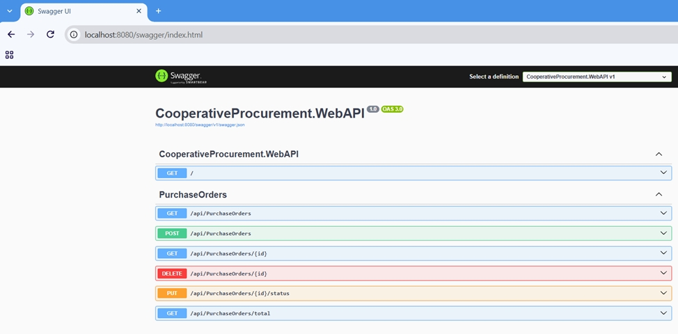
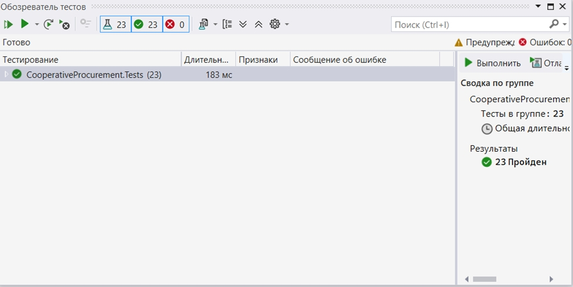
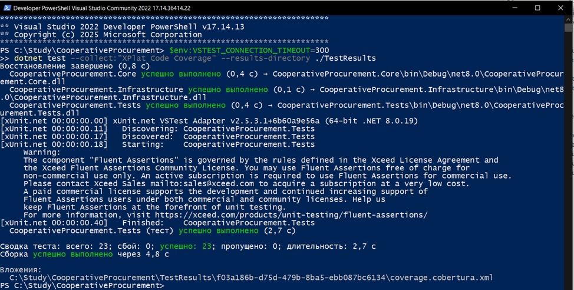
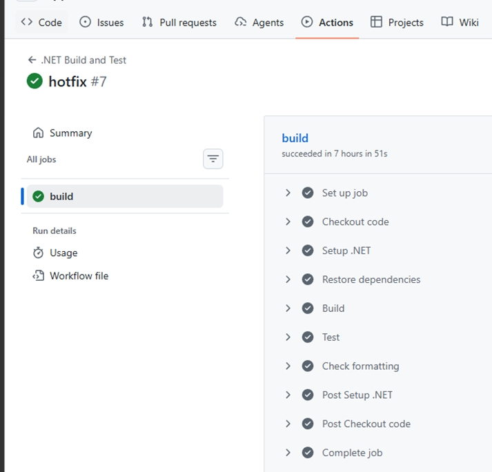
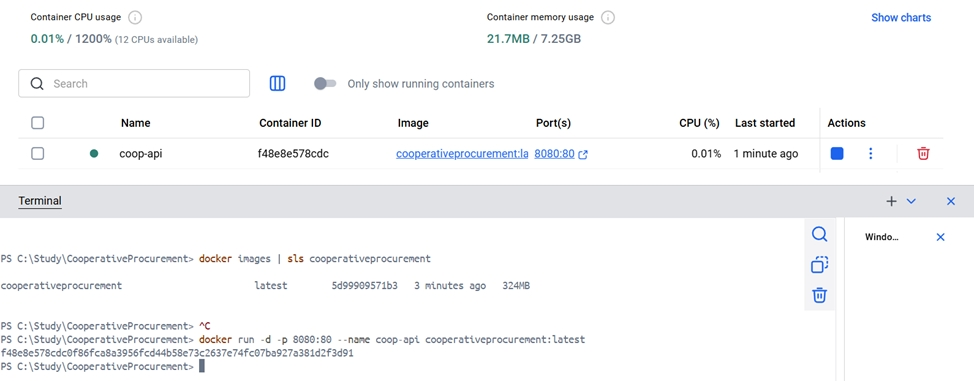

# CooperativeProcurement

[](https://github.com/ВАШ_ЛОГИН/CooperativeProcurement/actions/workflows/dotnet-build.yml)
[](https://opensource.org/licenses/MIT)
[](https://dotnet.microsoft.com/)
[](https://www.docker.com/)

> Учебный проект кейсового задания в рамках изучения инструментальных средствв разработки программного обеспечения.
> Информационная система для автоматизации процессов закупок потребительского кооператива.

---

## 📋 Содержание

- [О проекте](#-о-проекте)
- [Возможности](#-возможности)
- [Архитектура](#-архитектура)
- [Технологии](#-технологии)
- [Структура проекта](#-структура-проекта)
- [Быстрый старт](#-быстрый-старт)
  - [Локальный запуск](#локальный-запуск)
  - [Запуск через Docker](#запуск-через-docker)
- [API](#-api)
- [Тестирование](#-тестирование)
- [Качество кода](#-качество-кода)
- [CI/CD](#-cicd)
- [Скриншоты](#-скриншоты)
- [Автор](#-автор)
- [Лицензия](#-лицензия)

---

## 📖 О проекте

**CooperativeProcurement** - это веб-API для управления закупками потребительского кооператива. Проект демонстрирует применение современных инструментов разработки: многослойной архитектуры, систем контроля версий, синтаксического, семантического и статического анализа, CI/CD и контейнеризации.

**Цель проекта:** получить практические навыки разработки программного обеспечения с использованием профессиональных инструментов.

**Учебная дисциплина:** Инструментальные средства разработки программного обеспечения.

---

## ✨ Возможности

- [x] Создание заказов на закупку
- [x] Просмотр списка всех заказов
- [x] Получение заказа по идентификатору
- [x] Обновление статуса заказа (Draft, Submitted, Received)
- [x] Удаление заказов
- [x] Расчёт общей суммы заказов
- [x] Хранение данных в JSON-файле (без БД)
- [x] Валидация входных данных
- [x] XML-документация для публичных методов
- [x] Модульные тесты (xUnit + Moq)
- [x] Статический анализ (StyleCop, SonarAnalyzer)
- [x] CI/CD (GitHub Actions)
- [x] Контейнеризация (Docker)

---

## 🏗 Архитектура

Проект построен по принципу **многослойной архитектуры** (Layered Architecture) с разделением ответственности:
- CooperativeProcurement.WebAPI (ASP.NET Core Web API) - Контроллеры, DTO, маршрутизация 
- CooperativeProcurement.Infrastructure (Class Library) - Реализация доступа к данным (JSON)
- CooperativeProcurement.Core (Class Library) - Доменные модели, интерфейсы, сервисы
- CooperativeProcurement.Analyzers (Class Library) - Синтаксический, семантический анализ кода (Roslyn)
- CooperativeProcurement.Tests (xUnit Test Project) - модульные тесты


**Слои:**

| Слой | Назначение | Зависимости |
|------|-----------|-------------|
| **Core** | Доменные модели, интерфейсы, бизнес-логика | Нет |
| **Infrastructure** | Реализация репозиториев (JSON) | Core |
| **WebAPI** | REST API, контроллеры | Core, Infrastructure |
| **Analyzers** | Синтаксический, семантический анализ кода | Core, Infrastructure, WebAPI |
| **Tests** | Модульные тесты | Core, Infrastructure |

---

## 🛠 Технологии

| Технология | Версия | Назначение |
|-----------|--------|-----------|
| [.NET](https://dotnet.microsoft.com/) | 8.0 | Платформа разработки |
| [ASP.NET Core](https://learn.microsoft.com/aspnet/core/) | 8.0 | Веб-фреймворк |
| [xUnit](https://xunit.net/) | 2.5+ | Модульное тестирование |
| [Moq](https://github.com/moq/moq4) | 4.20+ | Mock-объекты |
| [FluentAssertions](https://fluentassertions.com/) | 8.11+ | Читаемые проверки |
| [StyleCop.Analyzers](https://github.com/DotNetAnalyzers/StyleCopAnalyzers) | 1.1.118 | Статический анализ стиля |
| [SonarAnalyzer.CSharp](https://github.com/SonarSource/sonar-dotnet) | 10.x | Анализ качества кода |
| [Roslyn](https://learn.microsoft.com/dotnet/csharp/roslyn-sdk/) | 4.13+ | Синтаксический анализ |
| [Docker](https://www.docker.com/) | 24+ | Контейнеризация |
| [GitHub Actions](https://github.com/features/actions) | — | CI/CD |

---

## 📁 Структура проекта
```
CooperativeProcurement/
├── .github/
│ └── workflows/
│ └── dotnet-build.yml # CI/CD workflow
├── CooperativeProcurement.Core/ # Доменный слой
│ ├── Models/
│ │ ├── OrderItem.cs
│ │ ├── OrderStatus.cs
│ │ └── PurchaseOrder.cs
│ ├── Interfaces/
│ │ └── IPurchaseOrderRepository.cs
│ └── Services/
│ └── PurchaseOrderService.cs
├── CooperativeProcurement.Infrastructure/ # Инфраструктурный слой
│ └── Repositories/
│ └── JsonPurchaseOrderRepository.cs
├── CooperativeProcurement.WebAPI/ # Слой представления
│ ├── Controllers/
│ │ └── PurchaseOrdersController.cs
│ ├── Requests/
│ │ ├── CreateOrderRequest.cs
│ │ └── UpdateStatusRequest.cs
│ └── Program.cs
├── CooperativeProcurement.Tests/ # Модульные тесты
│ ├── Models/
│ │ ├── OrderItemTests.cs
│ │ └── PurchaseOrderTests.cs
│ ├── Services/
│ └── PurchaseOrderServiceTests.cs
├── CooperativeProcurement.Analyzers/ # Roslyn-анализаторы
│ ├── Analyzers/
│ │ ├── MethodCommentAnalyzer.cs
│ │ └── CustomAnalyzer.cs
│ ├── Data/
│ ├── Services/
│ ├── GlobalSuppressions.cs
│ ├── SyntaxTreeWalker
│ └── Program.cs
├── .dockerignore
├── .editorconfig # Правила стиля кода
├── .gitignore
├── Dockerfile # Контейнеризация
├── CooperativeProcurement.sln
└── README.md
```

---

## 🚀 Быстрый старт

### Требования

- [.NET 8.0 SDK](https://dotnet.microsoft.com/download/dotnet/8.0)
- [Git](https://git-scm.com/downloads)
- [Docker Desktop](https://www.docker.com/products/docker-desktop) (опционально, для контейнеризации)

### Клонирование репозитория

```bash
git clone https://github.com/EgorSborschikov/CooperativeProcurement.git
cd CooperativeProcurement
```

### Локальный запуск
```bash
# Восстановление зависимостей
dotnet restore

# Сборка
dotnet build -c Release

# Запуск тестов
dotnet test

# Запуск API
dotnet run --project CooperativeProcurement.WebAPI
```

После запуска API будет доступно по адресам:
- **API:** http://localhost:5000/api/purchaseorders
- **Swagger UI:** http://localhost:5000/swagger (в Development)

### Запуск через Docker
```bash
# Сборка образа
docker build -t cooperativeprocurement:latest .

# Запуск контейнера
docker run -d -p 8080:8080 `
  -e ASPNETCORE_ENVIRONMENT=Development `
  --name coop-api cooperativeprocurement:latest

# Проверка
docker logs coop-api
```

## 📡 API

### Эндпоинты

| Метод | URL | Описание |
|-------|-----|----------|
| **GET** | `/api/purchaseorders` | Получить все заказы |
| **GET** | `/api/purchaseorders/{id}` | Получить заказ по ID |
| **POST** | `/api/purchaseorders` | Создать новый заказ |
| **PUT** | `/api/purchaseorders/{id}/status` | Обновить статус заказа |
| **DELETE** | `/api/purchaseorders/{id}` | Удалить заказ |
| **GET** | `/api/purchaseorders/total` | Получить общую сумму |

### Примеры запросов

**Создание заказа:**
```bash
curl -X POST http://localhost:8080/api/purchaseorders \
  -H "Content-Type: application/json" \
  -d '{
    "supplierName": "ООО Ромашка",
    "items": [
      { "name": "Молоко", "quantity": 10, "unitPrice": 85.50 },
      { "name": "Хлеб", "quantity": 20, "unitPrice": 45.00 }
    ]
  }'
```

**Получение всех заказов**
```bash
curl http://localhost:8080/api/purchaseorders
```

**Обновление статуса**
```bash
curl -X PUT http://localhost:8080/api/purchaseorders/{id}/status \
  -H "Content-Type: application/json" \
  -d '{ "status": 1 }'
```

### Модели данных

**PurchaseOrder**
```json
{
  "id": "3fa85f64-5717-4562-b3fc-2c963f66afa6",
  "supplierName": "ООО Ромашка",
  "orderDate": "2024-01-15T12:34:56Z",
  "items": [],
  "totalAmount": 1755.00,
  "status": 0
}
```

**OrderStatus**

| Значение | Название | Описание |
|-------|-----|----------|
| **0** | `Draft` | Черновик |
| **1** | `Submitted` | Отправлен |
| **2** | `Recieved` | Получен |

## 🧪 Тестирование

### Запуск тестов

```bash
dotnet test CooperativeProcurement.Tests/CooperativeProcurement.Tests.csproj
```

### Запуск с покрытием

```bash
dotnet test --collect:"XPlat Code Coverage" --results-directory ./TestResults
```

### Генерация HTML-отчета покрытия

```bash
# Установка ReportGenerator
dotnet tool install -g dotnet-reportgenerator-globaltool

# Генерация отчёта
reportgenerator -reports:"./TestResults/**/coverage.cobertura.xml" -targetdir:"./TestResults/CoverageReport" -reporttypes:Html
```

### Структура тестов
- 22 теста покрывают ключевые сценарии
- Покрытие: 85%+
- Фреймворк: xUnit + Moq + FluentAssertions

## ✅ Качество кода
Проект использует несколько инструментов для обеспечения качества:

### StyleCop.Analyzers
Проверка стиля кода (именование, отступы, документация):

```bash
dotnet build -c Release
```
Все предупреждения StyleCop настраиваются в **.editorconfig**.

### SonalAnalyzer.CSharp
Выявление ошибок, уязвимостей и ошибок реализации:

```bash
dotnet build -c Release
```

### Roslyn-анализаторы
Собственные анализаторы в проекте **CooperativeProcurement.Analyzers**:
- CP0001: Публичные методы должны иметь XML-комментарии
- CP0003: Пользовательское правило

### Автоматизация анализа кода
В **.csproj** включены:

```xml
<TreatWarningsAsErrors>true</TreatWarningsAsErrors>
<EnforceCodeStyleInBuild>true</EnforceCodeStyleInBuild>
```

## 🔄 CI/CD
Проект использует GitHub Actions для автоматизации.

**Workflow:**  dotnet-build.yml
Запускается при push и pull_request в ветку main.

**Шаги:**
1. Checkout кода
2. Установка .NET 8.0
3. Восстановление зависимостей (dotnet restore)
4. Сборка (dotnet build)
5. Тестирование (dotnet test)
6. Проверка форматирования (dotnet format --verify-no-changes)
7. Публикация Docker-образа в GHCR (опционально)

**Статус сборки**

Текущий статус отображается в бейдже в начале README.

## 📸 Скриншоты

### Swagger UI



### Результаты тестов



### Покрытие кода



### CI/CD Pipeline



### Docker-контейнер



---

## 👤 Автор

**ФИО:** Сборщиков Егор Иванович

**Преподаватель ЦК Информационных систем**

**Дисциплина:** Инструментальные средства разработки программного обеспечения

**Учебное заведение:** НКТ им. А.Н. Косыгина Новосибирского облпотребсоюза

---

## 📄 Лицензия

Проект распространяется под лицензией **MIT**. См. файл [LICENSE](LICENSE) для подробностей.

---

## 🙏 Благодарности

- [Microsoft](https://www.microsoft.com/) — за платформу .NET
- [DotNetAnalyzers](https://github.com/DotNetAnalyzers) — за StyleCop
- [SonarSource](https://github.com/SonarSource) — за SonarAnalyzer
- [xUnit](https://xunit.net/) — за фреймворк тестирования
